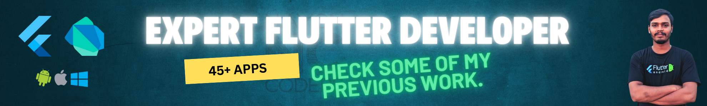

  

<h1 align="center">Hi 👋, I'm Nayon Coders</h1>
<h3 align="center">Flutter Developer(Android, iOS, Web, Desktop, Mac) & UI/UX Designer</h3>

  

### 👨‍💻 About Me  
- 🔥 I specialize in **Flutter Development** (Android, iOS, Web, Desktop, Mac).  
- 🎨 Skilled in **UI/UX Design**, creating seamless and interactive user experiences.  
- 🌱 Currently diving deep into **Python & AI** to expand my expertise.  
- 💡 Ask me about **Dart, Flutter, PHP, JavaScript, MySQL, Firebase, and more!**  
- 📝 I love sharing knowledge—read my articles on **Quora, Stack Overflow, etc.**  
- 🎯 Check out all my projects at **[www.nayon-coders.com](https://nayon-coders.bright-futureit.com)**  

<h3 align="left">Connect with me:</h3>

  

<h3 align="left">Languages and Tools:</h3>

                       

&nbsp;

